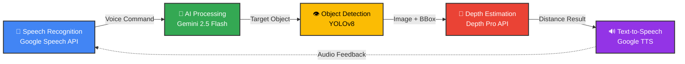
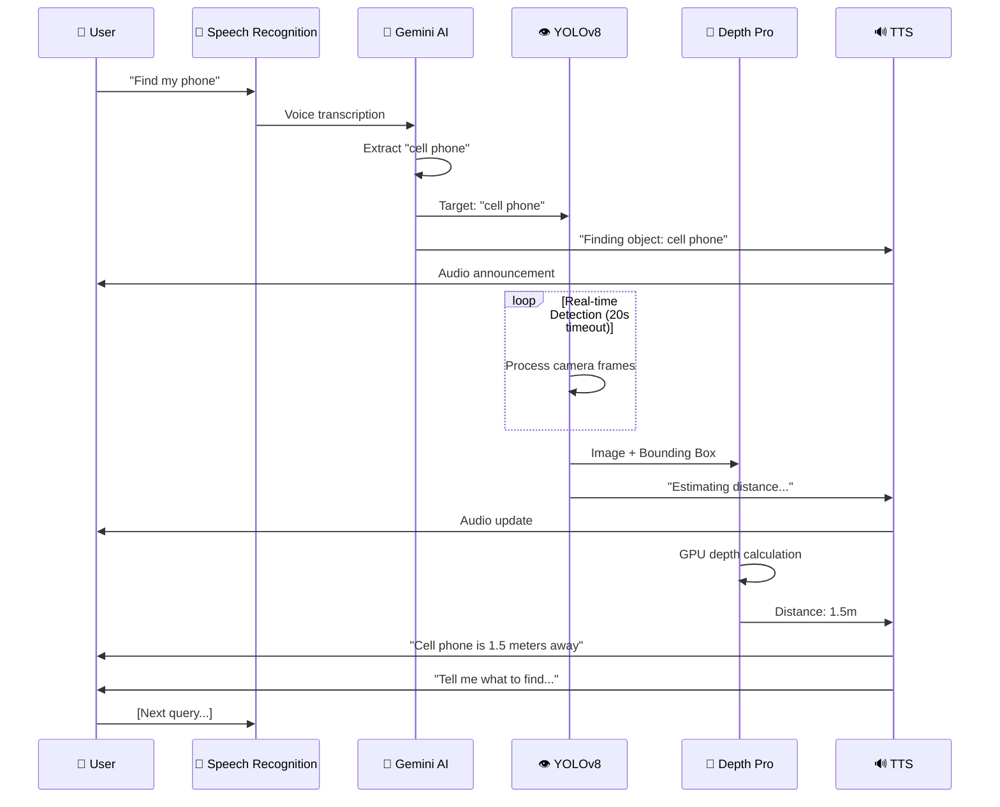

# Juno Vision Guide

<div align="center">


</div>

> **AI-Powered Voice-Controlled Object Detection & Distance Estimation System**  
> A sophisticated ROS-based vision assistant demonstrating distributed system design, real-time computer vision, and multi-AI service integration.

---

## 🎯 Project Overview

An intelligent robotics application that combines **Google Gemini AI**, **YOLOv8 object detection**, and **Depth Pro API** to enable natural language object finding with accurate distance estimation. Users simply speak commands like *"Find my phone"* and the system detects, locates, and announces the distance to the object.

### 📹 Demo

> **"Find my phone"** → System detects → **"The cell phone is approximately 1.5 meters away"**

*Note: Add demo.gif here showcasing the system in action*

### 📊 Project Stats

- **5 ROS Nodes** working in distributed architecture
- **80+ Object Classes** supported via YOLO
- **7 ROS Topics** for inter-node communication  
- **3 AI APIs** integrated (Gemini, Depth Pro, Speech Recognition)
- **30+ FPS** real-time object detection
- **<2s** average response time (excluding depth API)

### Core Technologies

| Category | Stack |
|----------|-------|
| **Framework** | ROS Noetic, Python 3.10+ |
| **Computer Vision** | YOLOv8, OpenCV |
| **AI/NLP** | Google Gemini 2.5 Flash |
| **Depth Estimation** | Depth Pro API (Hugging Face) |
| **Voice I/O** | Google Speech Recognition, Google TTS |

---

## 🏗️ System Architecture

**Distributed ROS Architecture** with 5 interconnected nodes:



**Key Design Patterns**: Pub/Sub messaging (7 ROS topics) • State synchronization • 20s timeout with error recovery • RESTful API integration

---

## 🔄 User Workflow



---

## ⚡ Key Features

- ✅ **Voice-Controlled Object Finding** - Natural language queries (*"Where is my laptop?"*)
- ✅ **Real-Time Vision Processing** - YOLOv8 detection at 30+ FPS
- ✅ **Accurate Distance Estimation** - GPU-powered depth calculation
- ✅ **80+ Object Classes** - Comprehensive YOLO object support
- ✅ **Hands-Free Operation** - Complete audio interaction loop
- ✅ **Smart NLP** - Synonym mapping (iPhone→phone, MacBook→laptop)

---

## 🚀 Quick Start

### Prerequisites
Ubuntu 18.04 • ROS Noetic • Python 3.10+ • USB Camera + Microphone

### Installation & Run

```bash
# Clone & setup
cd ~/catkin_ws/src/
git clone https://github.com/NeoSockCheng/juno-vision-guide.git
conda env create -f environment.yml && conda activate juno_vision_guide

# Add API keys to scripts/.env: GEMINI_API_KEY, DEPTH_PRO_API_KEY

# Build & launch
cd ~/catkin_ws && catkin_make && source devel/setup.bash
roscore  # Terminal 1

roslaunch juno_vision_guide juno_vision_guide.launch  # Terminal 2
```

---

## 📊 Technical Implementation

**Distributed Architecture**: 5 Python ROS nodes (`google_sr.py`, `speech_input.py`, `object_detection.py`, `object_depth_estimation.py`, `google_tts.py`)

**AI/NLP**: Gemini 2.5 Flash with prompt engineering for object extraction + synonym mapping (iPhone→phone)

**Computer Vision**: YOLOv8 @ 70% confidence • JSON bounding boxes • JPEG compression • 20s timeout

**State Management**: Global flags (`depth_busy`, `object_captured`) for asynchronous workflow synchronization

**Configuration**: Camera/Mic device index: 1 • Detection timeout: 20s • Depth API: Hugging Face

---

## 📁 Project Structure

```
juno_vision_guide/
├── scripts/                    # ROS nodes (Python)
│   ├── google_sr.py           # Speech recognition
│   ├── speech_input.py        # Gemini NLP processing
│   ├── object_detection.py    # YOLOv8 detection
│   ├── object_depth_estimation.py  # Depth API integration
│   └── google_tts.py          # Text-to-speech
├── launch/
│   └── juno_vision_guide.launch  # Multi-node orchestration
├── environment.yml            # Conda dependencies
├── yolov8n.pt                # YOLO model weights (6.5MB)
└── yolo_object_list.json     # 80 object class mappings
```

---

## 🎓 Skills Demonstrated

<table>
<tr>
<td width="50%">

### 🤖 Robotics & Systems
- **ROS Architecture** - Multi-node orchestration
- **Pub/Sub Messaging** - Asynchronous communication
- **Distributed Systems** - 5-node coordination
- **State Management** - Global flags & synchronization
- **Launch Files** - System bootstrapping

### 💻 Computer Vision
- **YOLOv8** - Real-time object detection
- **OpenCV** - Image processing & manipulation
- **Bounding Box** - Detection data extraction
- **Image Compression** - JPEG encoding/decoding

### 🧠 AI/ML Integration
- **Google Gemini API** - NLP & prompt engineering
- **LLM Integration** - Contextual object extraction
- **Synonym Mapping** - Intelligent name resolution

</td>
<td width="50%">

### ☁️ Cloud & APIs
- **RESTful APIs** - HTTP POST/GET requests
- **Authentication** - API key management
- **Base64 Encoding** - Image transmission
- **Error Handling** - API timeout/retry logic

### 🎙️ Audio Processing
- **Speech Recognition** - Google Speech API
- **TTS Synthesis** - Voice feedback generation
- **Noise Adjustment** - Ambient audio filtering

### 🐍 Python Development
- **Threading** - Asynchronous workflows
- **Error Recovery** - Graceful degradation
- **JSON Processing** - Data serialization
- **Environment Variables** - Configuration management

</td>
</tr>
</table>

---

## 📜 License

MIT License - Open source for educational and commercial use

---

## 🔗 Links

- **YOLO**: [Ultralytics YOLOv8](https://github.com/ultralytics/ultralytics)
- **Gemini API**: [Google AI Studio](https://aistudio.google.com/)
- **Depth Pro**: [Hugging Face Space](https://huggingface.co/spaces/yzh70/depth-pro)

---

*Built with ❤️ for intelligent robotics applications*